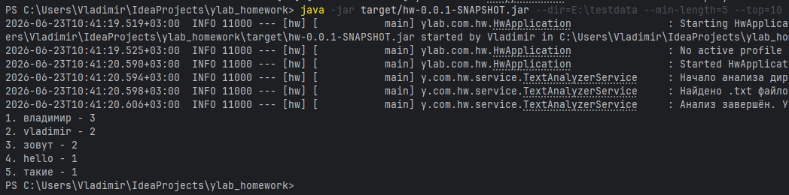
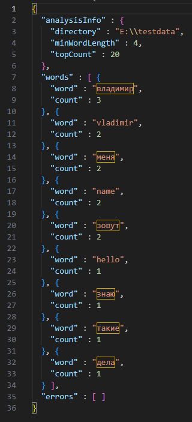
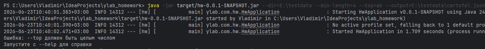
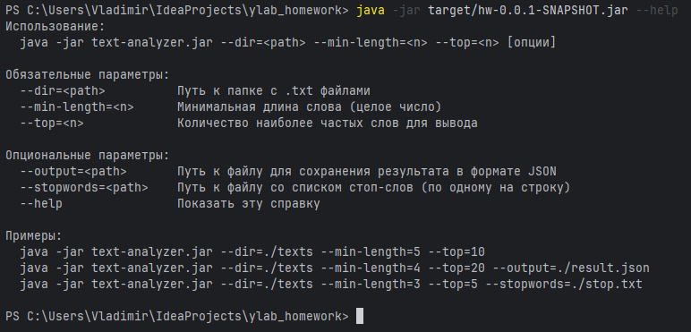

# Text Analyzer

Консольное приложение на Java 17 + Spring Boot 3 для анализа частоты слов в текстовых файлах.

## Сборка

```bash
mvn clean package -DskipTests
```

Артефакт: `target/hw-0.0.1-SNAPSHOT.jar`

## Запуск

```bash
java -jar target/hw-0.0.1-SNAPSHOT.jar --dir=<path> --min-length=<n> --top=<n> [опции]
```

### Параметры

| Параметр | Обязательный | Описание |
|---|---|---|
| `--dir` | ✅ | Путь к папке с `.txt` файлами |
| `--min-length` | ✅ | Минимальная длина слова |
| `--top` | ✅ | Количество наиболее частых слов |
| `--output` | ❌ | Путь к JSON-файлу для сохранения результата |
| `--stopwords` | ❌ | Путь к файлу со стоп-словами (по одному на строку) |
| `--help` | ❌ | Справка по параметрам |

## Примеры использования

### Базовый запуск
```bash
java -jar target/hw-0.0.1-SNAPSHOT.jar --dir=./texts --min-length=5 --top=10
```

### С сохранением в файл
```bash
java -jar target/hw-0.0.1-SNAPSHOT.jar --dir=./texts --min-length=4 --top=20 --output=./result.json
```

### Со стоп-словами
```bash
java -jar target/hw-0.0.1-SNAPSHOT.jar --dir=./texts --min-length=3 --top=5 --stopwords=./stop.txt
```

### Справка
```bash
java -jar target/hw-0.0.1-SNAPSHOT.jar --help
```

## Пример вывода в консоль

```
1. development — 112
2. process — 97
3. engineering — 83
4. software — 71
5. system — 64
```


## Пример JSON вывода (`--output`)

```json
{
  "analysisInfo": {
    "directory": "./texts",
    "minWordLength": 5,
    "topCount": 10
  },
  "words": [
    { "word": "development", "count": 112 },
    { "word": "process", "count": 97 },
    { "word": "engineering", "count": 83 }
  ],
  "errors": []
}
```



## Обработка ошибок

- Если `--dir` не существует — выводит ошибку и завершается
- Если файл недоступен — фиксирует в поле `errors` JSON / выводит в консоль
- Пустые файлы — пропускаются с предупреждением в лог
- Неверные параметры — выводит подсказку с `--help`



## Команда /help



## Структура проекта

```
src/main/java/ylab/com/hw/
├── HwApplication.java           # точка входа, CommandLineRunner, валидация
├── config/
│   ├── AppConfig.java           # параметры запуска (@ConfigurationProperties)
│   └── ObjectMapperConfiguration.java
├── dto/
│   ├── AnalysisResult.java      # результат анализа (JSON-структура)
│   ├── WordFrequency.java       # слово + количество
│   └── FileError.java           # ошибка файла
├── service/
│   ├── TextAnalyzer.java        # интерфейс анализатора
│   ├── TextAnalyzerService.java # реализация
│   └── HelpPrinter.java        # вывод справки
└── formatter/
    ├── ResultFormatter.java     # интерфейс форматтера
    ├── ConsoleFormatter.java    # вывод "1. word — N"
    └── JsonFormatter.java       # вывод JSON
```